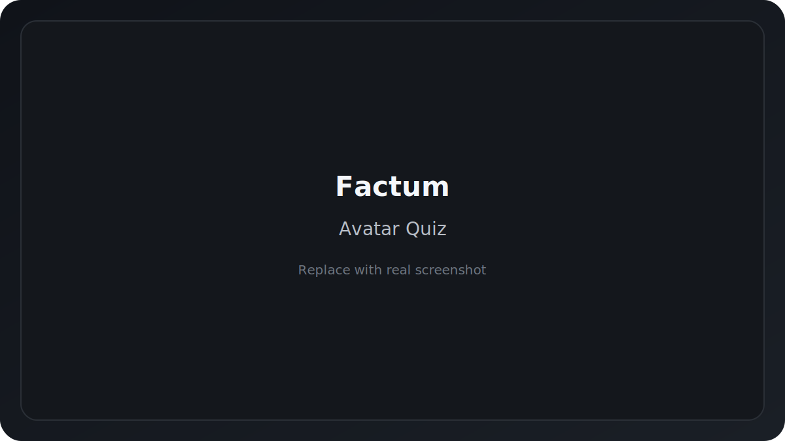
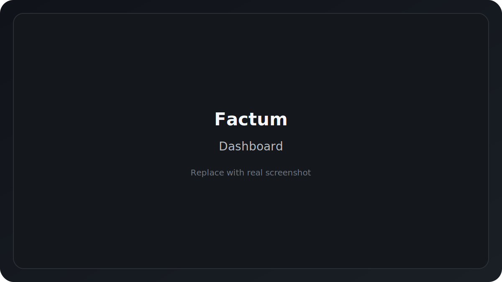
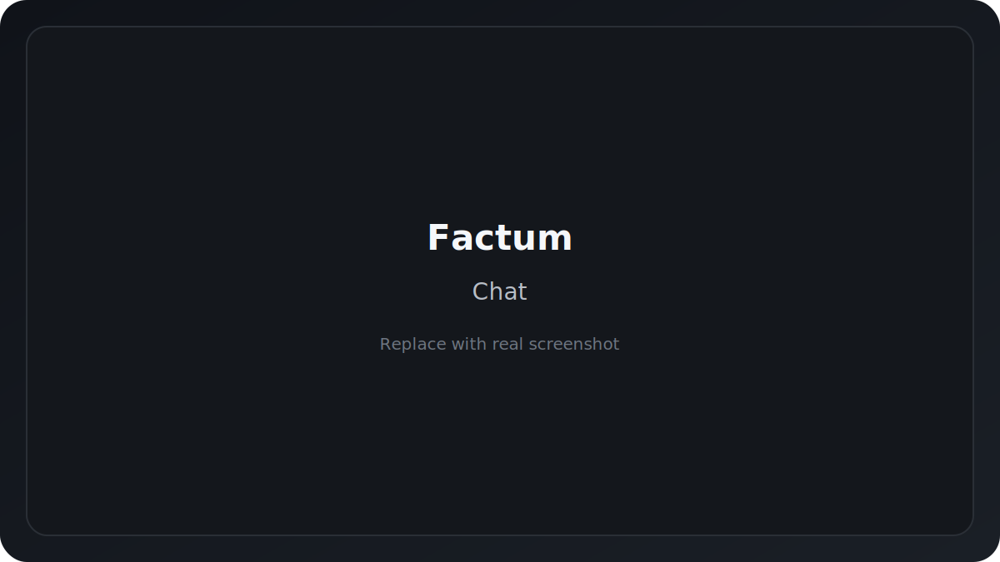

# Factum

**Factum** is a personal mental health companion: avatar matching, daily check-ins, AI-supported chat, sleep tracking, and a 30-day reflection marathon.

<p align="center">
  <a href="https://skillicons.dev">
    
  </a>
</p>

> This project focuses on self-support and reflection. It is not a medical app and does not replace professional help.

## What the app does (detailed)

1. **Sign in / sign up** via Supabase (email+password) or Google OAuth.
2. **Personality quiz** selects your companion avatar (Luna, Sunny, Sage, Spark, Haven) using weighted answers.
3. **Reveal screen** introduces the chosen avatar and their specialization.
4. **Main app** with navigation across key sections:
   - **Dashboard** — greeting, streak, experience, quick actions.
   - **Chat** — conversation with the avatar (Gemini API + local fallback).
   - **Sleep** — optimal wake time calculation based on 90-minute cycles.
   - **Daily check-in** — short daily survey that grows experience and streak.
   - **Progress** — levels, achievements, 7-day mood trend.
   - **Marathon** — 30-day journal with questions and a final summary.
   - **Settings** — language, theme, notifications, privacy, data reset.

## Core features

- **Companion chat** with persona-based responses and practical support.
- **Avatar matching** via a weighted personality quiz.
- **Daily check-in** that tracks mood and grows streak/experience.
- **Sleep tracker** with cycle-based wake time suggestions.
- **30-day marathon** with daily questions, notes, and a summary.
- **Progress** with levels, achievements, and weekly trends.
- **Light/dark theme** and **EN/RUS** language support.

## Screenshots

<div align="center">
  
  
  
  
</div>

> Replace the SVG placeholders with real screenshots or GIF demos in `docs/screenshots/`.

## Tech stack

- **React 18 + TypeScript**
- **Vite**
- **Tailwind CSS**
- **Supabase Auth**
- **Gemini 1.5 Flash**

  
## Local setup

[](https://skillicons.dev)

1. Install dependencies:
   ```bash
   npm install
   ```
2. Create `.env` (see variables below).
3. Start the dev server:
   ```bash
   npm run dev
   ```

Additional commands:
- Build: `npm run build`
- Preview: `npm run preview`
- Typecheck: `npm run typecheck`
- Lint: `npm run lint`

## Environment variables

Create a `.env` file in the project root:

```bash
VITE_SUPABASE_URL=...
VITE_SUPABASE_ANON_KEY=...
VITE_GEMINI_API_KEY=...
VITE_GEMINI_API_KEY_2=...
VITE_GEMINI_API_KEY_3=...
```

- **Supabase** is used for authentication only. If the variables are not set, defaults from `src/utils/supabase.ts` are used.
- **Gemini API** powers chat responses. If keys are missing, the local fallback responses are used.

## Project structure

```
src/
  components/      // screens and UI components
  data/            // quiz questions and avatars
  utils/           // logic (avatars, sleep, levels, AI)
  types/           // data types
  index.css        // themes and design system
sql_scheme.sql     // DB schema (optional for Supabase)
```

## Data and privacy

- Core data (user, messages, check-ins, marathon) is stored in **localStorage**.
- Settings include a **full data wipe** on the device.
- Chat context is limited to the **last 8 messages**.

## Documentation

Detailed technical documentation is in `DOCUMENTATION.md`.

---

If you want to add backend storage, see `sql_scheme.sql` for a Supabase/PostgreSQL-ready schema.
